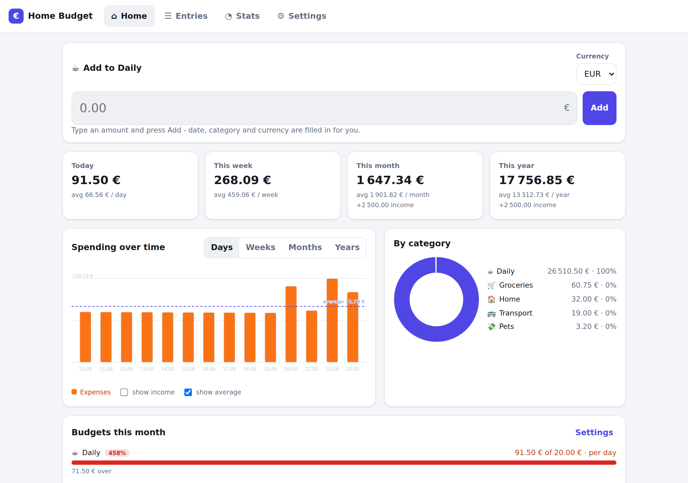
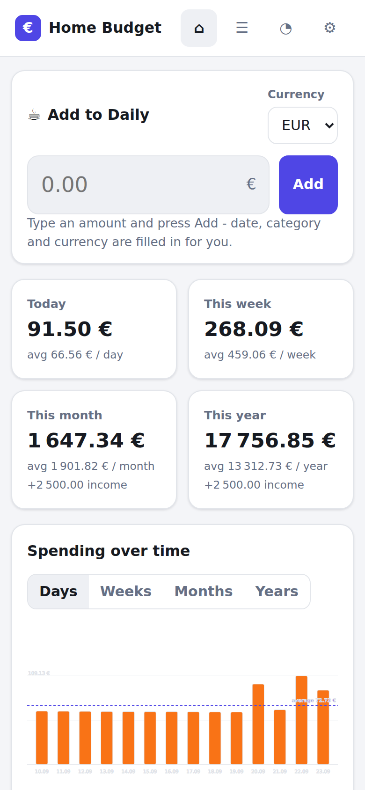
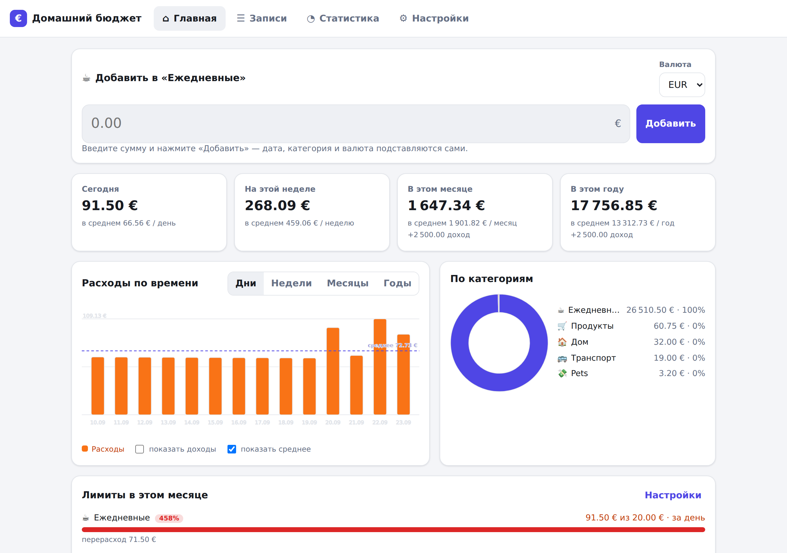
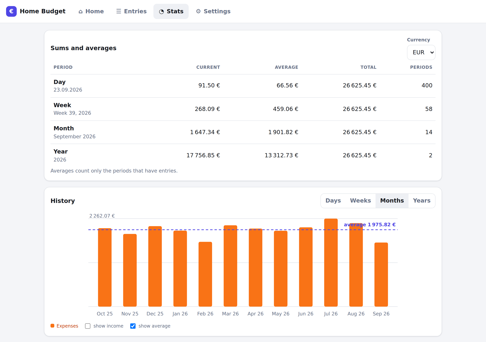
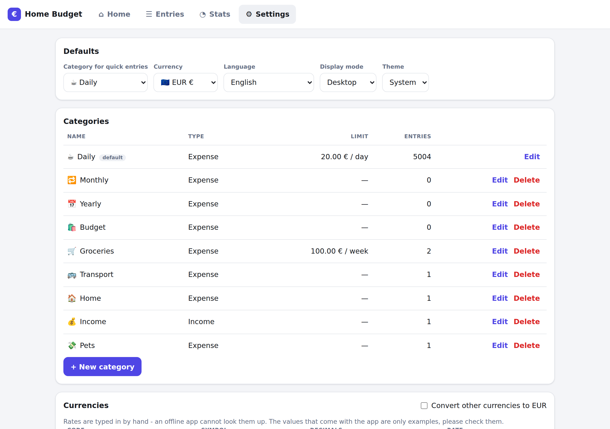
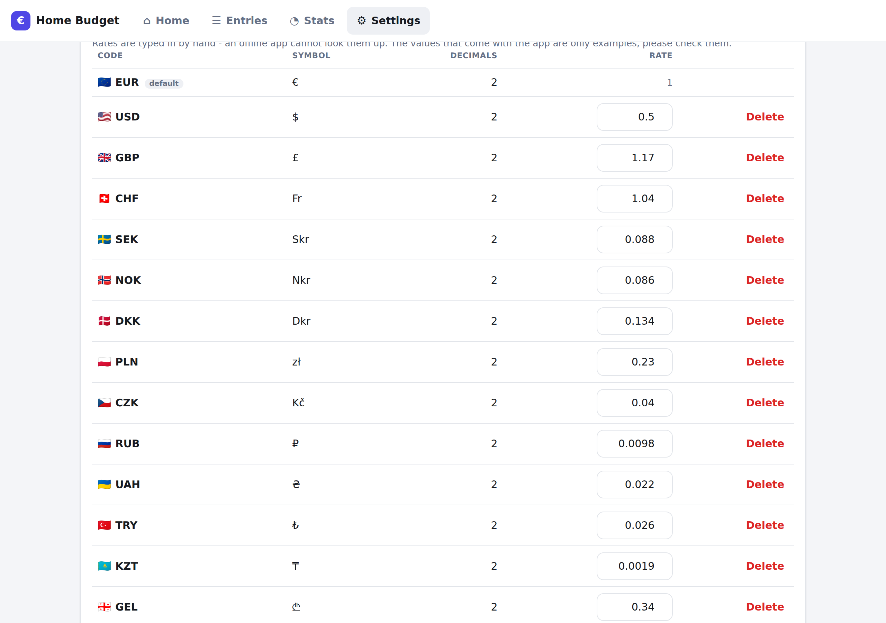

# Home Budget 3.3.0 (browser version)

A home budget app that is **one HTML file**. All JavaScript, CSS and even the PDF font are inlined,
there are no external requests, no frameworks and no build-time dependencies. Open the file from a
USB stick, a local folder or an offline laptop and it works. The same file is also published as an
**installable web app** on GitHub Pages.



## What it does

- **Quick add:** type an amount, press **Add**. The entry goes to the default category (**Daily**),
  with today's date and the default currency. Nothing else has to be filled in.
- **Predefined categories** for the spending rhythms - **Daily**, **Monthly**, **Yearly** - plus
  **Budget** for planned shopping, Groceries, Transport, Home and Income. Every category has an emoji,
  a colour and an optional **limit with its own period** (per day, week, month or year); the limits show
  up as progress bars on the home screen and turn red when exceeded.
- **Entries:** full form for date, category, currency and note; filter by period, category,
  currency or text; tap a row (or click *Edit*) to change it.
- **Statistics:** sums and averages per **day, week, month and year**, a bar chart of the last
  periods (days / weeks / months / years) with an **average line**, a donut chart and a ranking per
  category, plus highlights such as the largest single expense. Month and week names follow the
  interface language, on screen and in the exports - "Сентябрь 2026", "September 2026", "39-я неделя".
- **Export:** CSV, Excel (.xlsx) and PDF of exactly the entries the filters show. The PDF starts with a
  drawn bar chart (vector graphics, average line included) and the spreadsheet gets a second sheet with
  the chart data and a **real Excel chart** - so the chart stays editable in Excel, LibreOffice or Numbers.
  The PDF carries **its own font**, so Russian, German, Greek and accented text print as text, and the
  text stays selectable and searchable in a reader.
- **Import:** CSV and .xlsx files. The column layout is **detected automatically** — by header names
  (English, German, Estonian, Spanish, Russian and more) or, when there is no header, by what the
  columns contain. The detected mapping is shown and can be corrected before importing.
- **Languages:** English, Russian and German, picked automatically from the browser or chosen in the
  settings. A built-in editor lets you write **your own translation** of every text; it is stored in the
  browser and can be downloaded and shared as a JSON file.
- **Currencies:** twenty-four come with the app - EUR, USD, GBP, CHF, SEK, NOK, DKK, PLN, CZK, **RUB**,
  UAH, TRY, KZT, GEL, RON, HUF, BGN, CAD, AUD, NZD, JPY, CNY, INR, ILS - each with its **flag** and with
  a symbol that belongs to it alone: the three Nordic crowns read Skr / Nkr / Dkr and the Chinese yuan
  CN¥, so an amount always says which currency it is in. More can be added, and a currency you add gets
  a matching flag by itself. Each has an editable **rate** against
  the default currency, and a switch folds every currency into the default one for the dashboard, the
  statistics and the budgets. Rates are typed in by hand - an offline app cannot fetch them, and the
  shipped values are only examples.
- **Configurable:** categories (name, type, colour, emoji, limit, limit period) and currencies (code,
  symbol, flag, decimals, rate), the default category and currency, light/dark theme and mobile/desktop
  layout. A limit is shown with the period it is for, so the column is simply **Limit** - it has not
  been monthly-only since version 3.
- **Storage:** everything stays in the browser's `localStorage`, which holds roughly **30 000 entries**
  (see *Limits* below). `sessionStorage` and an in-memory store are used as fallbacks when a browser
  blocks storage, so the app still runs in private mode. A JSON backup can be downloaded and restored.
- **Two ways to start over**, and the difference is spelled out in the settings: **Delete all entries**
  removes the entries and keeps your categories, currencies, rates and settings, while **Reset
  everything** puts the app back to how it ships. Both ask first.

| Mobile | Russian interface |
|---|---|
|  |  |

| Statistics | Settings |
|---|---|
|  |  |



## Limits

| | |
|---|---|
| Amount | from one minor unit (0.01 €, 1 ¥) to **1 000 000 000** major units per entry; zero is refused |
| Note | 200 characters |
| Category name | 40 characters |
| Currency | code 2-5 letters, 0-4 decimals, rate above zero |
| Date | any real date, `yyyy-mm-dd` |
| Entries | no fixed limit; about **30 000** fit in the 5 MB a browser gives one page |

Amounts are integer minor units, and the ceiling is what keeps them exact: a thousand million per
entry is far beyond a home budget, and thirty thousand of them still add up well inside the range
where JavaScript integers are exact, so no single entry can turn the totals into nonsense. Typing
more is refused with a message rather than silently stored at reduced precision. An amount that
rounds away in its currency (`0.001` in euros) says it is too small instead of claiming it is zero,
and scientific notation is refused outright - `1e15` used to come out as 115.00 without a word.

The entry list draws **200 rows at a time**, with *Show 200 more* and *Show all* underneath; the
summary, the statistics and the exports always cover every matching entry - the export panel says so -
only the table is paged.
That is what keeps a big store usable: with 30 000 entries a render takes 12 ms instead of 1.5 s.

Storage is the real ceiling on how many entries fit. Measured with real data:

| Entries | In `localStorage` | Render |
|---|---|---|
| 1 000 | 153 kB | 6 ms |
| 10 000 | 1.5 MB | 9 ms |
| 30 000 | 4.6 MB | 12 ms |

Past that a browser refuses to save and the app says so, keeping what is already stored - the moment
to export a backup and start a fresh file, or to remove old entries.

## Using it

Open `home-budget-3.3.0.html` (or `home-budget.html`, the same build under a name that never changes)
in any modern browser - Chrome, Edge, Firefox, Safari. Nothing to install. Amounts are stored as whole
cents, so no rounding errors creep in. Data saved by an older version is upgraded automatically on first
start: entries and categories are kept, and anything new (icons, limit periods, currency rates, currency
flags) appears with sensible defaults. The version is visible in three places: the file name, the page
footer and **Settings → About**; the saved data also records which version last wrote it.

Data belongs to one browser profile on one device: a different browser or a private window starts
empty. Use the JSON backup in **Settings → Data** to move data, and remember that clearing site data
deletes it.

.xlsx files are ZIP archives, so import and export use the browser's built-in compression
(`CompressionStream`, available in Chrome/Edge 80+, Safari 16.4+, Firefox 113+). CSV and PDF work
everywhere.

### As an app on the phone or desktop

`npm run build:site` produces `site/`, ready for GitHub Pages: the app as `index.html`, a web app
manifest, PNG icons and a service worker. Published, it can be **installed to the home screen** and
then starts like any other app, full screen and without a browser bar. The service worker keeps the
whole app in the cache, so it opens offline and instantly after the first visit; a new release uses a
new cache and the old one is deleted.

The page also asks to be cached forever (`Cache-Control: public, max-age=31536000, immutable`). That is
honest here: a built file never changes, and a new release is a new file. When you serve the versioned
file yourself, send that same header.

To publish: enable **Settings → Pages → Source: GitHub Actions** once. `.github/workflows/pages.yml`
then tests, builds and deploys every push to `main`, and `.github/workflows/release.yml` attaches the
built files to a release when a tag like `v3.3.0` is pushed.

## Building

```bash
npm run build          # dist/home-budget-<version>.html and .min.html
npm run build:plain    # the same, named home-budget.html and .min.html (no version in the name)
npm run build:site     # site/ ready for GitHub Pages: app, manifest, icons, service worker
npm test               # unit tests
npm run coverage       # unit tests + coverage thresholds
npm run browser-check  # end-to-end check of both builds in Chromium
npm run site-check     # serves site/ and checks the installable app, offline included
npm run check          # everything above
```

Two names for the same build, on purpose: the versioned one can be archived and cached forever, the
plain one is a link that always points at the latest release. The version travels **inside** every
build either way - in the banner, the `<title>`, the meta tag, the footer, the About card, the PDF
footer and the saved data.

The version lives in `src/core/version.js` and nowhere else, and a unit test fails if `package.json`
drifts away from it.

There are **no dependencies** — Node 22 (or newer) runs everything. `tools/bundle.mjs` contains a
small ES module bundler and a conservative minifier: it strips comments and redundant whitespace but
never renames anything, so the minified file stays debuggable and behaves identically. Both builds
are verified by the same browser check.

Two generators produce checked-in source, so a normal build never needs them:

```bash
npm run font    # src/core/font-data.js  - subsets DejaVu Sans for the PDF export
npm run icons   # assets/*.png           - the app icons for the site build
```

`tools/make-font.mjs` is a small TrueType subsetter: it reads the system's DejaVu Sans, keeps the
585 glyphs the interface can need (Latin, Latin Extended-A, Greek, Cyrillic, punctuation, currency
signs), renumbers composite glyphs, drops the hinting programs and deflates the result. The 30 kB that
lands in `font-data.js` is what the PDF embeds, compressed already, so nothing is unpacked at runtime.
`tools/make-icons.mjs` draws the icons and writes the PNGs by hand (deflate plus CRC32) - again, no
dependency.

## Structure

```
src/
  core/          logic with no DOM, fully unit tested
    version.js     the single version source
    format.js      money and date formatting, parsing, period keys
    i18n.js        English, Russian and German texts, month names, user translations
    model.js       entries, categories, currencies, flags, limits, conversion
    store.js       application state and all operations on it
    storage.js     localStorage / sessionStorage / memory, migration and repair
    stats.js       sums, averages, series, budgets and category breakdowns
    charts.js      SVG bar (with average line) and donut charts
    csv.js         CSV reader and writer with delimiter detection
    zip.js         ZIP reader and writer (for .xlsx)
    xlsx.js        .xlsx reader and writer, including a native Excel chart
    pdf.js         PDF writer (embedded font, paginated table, vector chart)
    font-data.js   generated: the DejaVu Sans subset and its glyph widths
    importer.js    column detection and row conversion
    exporter.js    entries -> CSV / XLSX / PDF
  ui/            DOM layer: shell, views, dialogs
  index.html     template: metadata, app.css styles, main.js entry point
assets/          generated app icons for the site build
tools/           bundler, build script, font and icon generators, browser checks
test/            unit tests (node:test)
```

The UI layer only reads from and calls into `core`; `core` has no reference to the DOM, which is why
it can be tested in Node and why the same logic runs in the export/import code paths.

Form rows follow one rule, which is what keeps controls from drifting out of line: every text-like
control is exactly `--control-height` tall, every field label exactly `--label-height`, and a row is
aligned to its **top**. A longer label, a hint underneath or a control the browser sizes differently -
a colour picker, a select, a date field - then moves nothing else, and a button standing in such a row
is pushed down by exactly one label height.

### How the PDF prints Cyrillic

A PDF's built-in fonts only know Latin-1, which is why version 3.0 wrote `?` for every Russian letter.
The export now embeds the font subset as a **CIDFontType2 with Identity-H encoding**: text is written as
glyph ids, the widths come from the font's own metrics, and a `/ToUnicode` map translates the glyph ids
back to code points so text can still be selected, copied and searched. There is one font in the file -
bold is drawn by stroking the outline as well as filling it - which keeps the app about 30 kB larger
rather than 60. Characters the subset has no glyph for (emoji, for instance) are dropped rather than
replaced by a box, and the gap they leave is closed.

## Tests

```
npm run coverage
```

113 tests covering the core modules, including round trips (CSV → parse → CSV, XLSX write → read,
ZIP write → read), the embedded PDF font (flate stream length, Identity-H structure, the `/ToUnicode`
map, Cyrillic written as glyphs, the cross reference table), charts, storage upgrades from older data,
budget calculations per limit period, currency conversion, unique flags and symbols, localized period
labels, deleting entries versus resetting everything, version consistency, translation completeness
(every language has every key exactly once and with the same placeholders), and the import detection
for files with and without headers. The run **fails below 90%** line, branch and function coverage of
`src/core`; it currently sits at about 99% lines, 95% branches.

`tools/browser-check.mjs` additionally drives the built file in headless Chromium (38 checks): it adds
an entry through the quick form, checks that it is stored and survives a reload, exports CSV/XLSX/PDF
and verifies the produced bytes (including the chart parts and the embedded font), exports a Russian
PDF and asserts it contains real Cyrillic and no question marks, imports a semicolon-separated German
CSV, switches the interface between English, Russian, German and a user translation written in the
settings editor, checks the version stamp, the cache and web app metadata, the average line, the budget
bars with their periods, the ruble, the currency flags and that no two currencies share a symbol,
confirms that deleting the entries keeps the settings while resetting really restores the defaults,
**measures every row of form controls** - in the cards, in the filters and in the dialogs - and fails
when a label of a different length or a hint under one field pushes its control off the line its
neighbours sit on, adds five thousand entries at once to check that the list pages instead of drawing
them all, refuses the amounts that would break the totals, and takes the screenshots in this README. It fails if anything logs an error to the console.

`tools/site-check.mjs` serves `site/` over HTTP, checks the manifest and the icons, waits for the
service worker to fill its cache, then **switches the network off and reloads** to prove the published
app really works offline.
