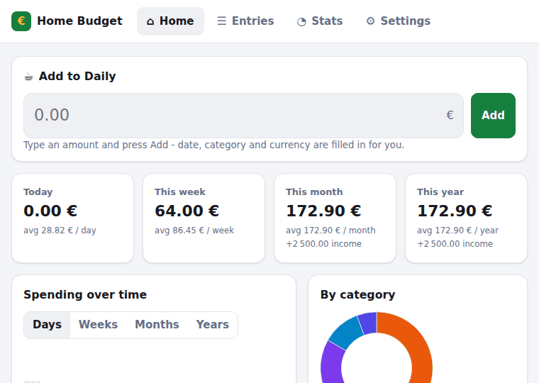
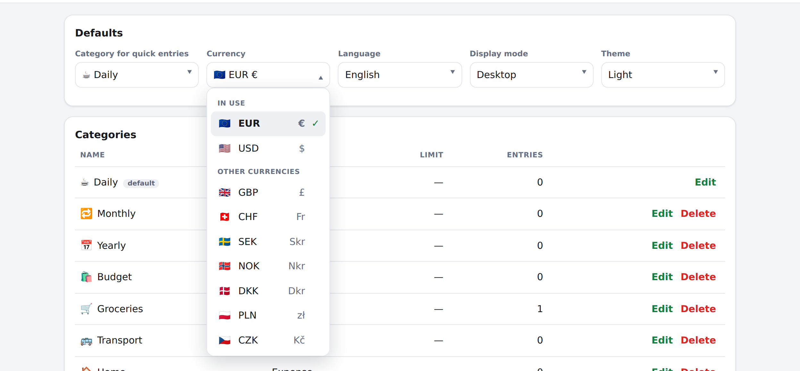

# Home Budget 3.20.0 (browser version)

<table>
<tr>
<td>

**[Open the app](https://mm3.github.io/home-budget-web/)**

[Download the single file](https://mm3.github.io/home-budget-web/home-budget.html)
(readable, not minified - it is meant to be read)

[Source on GitHub](https://github.com/mm3/home-budget-web)

[](https://github.com/mm3/home-budget-web/actions/workflows/pages.yml)

</td>
<td align="center">

<a href="https://mm3.github.io/home-budget-web/"></a>

Point a phone at it

</td>
</tr>
</table>

A home budget app that is **one HTML file**. All JavaScript, CSS and even the PDF font are inlined,
there are no external requests, no frameworks and no build-time dependencies. Open the file from a
USB stick, a local folder or an offline laptop and it works. The same file is also published as an
**installable web app** on GitHub Pages.



## What it does

- **Quick add:** type an amount, press **Add**. The entry goes to the default category (**Daily**),
  with today's date and the default currency. Nothing else has to be filled in. **Add with details**,
  next to it, opens the full form when the category, the date, the currency or a note is not the usual
  one. The coin in the corner carries the symbol of the currency the figures are shown in, so it is
  never a guess which one you are looking at.
- **Predefined categories** for the spending rhythms - **Daily**, **Monthly**, **Yearly** - plus
  **Budget** for planned shopping, Groceries, Transport, Home and Income. Every category has an emoji,
  a colour and an optional **limit with its own period** (per day, week, month or year); the limits show
  up as progress bars on the home screen and turn red when exceeded.
- **Entries:** full form for date, category, currency and note. An entry can be in **several
  categories** - one main one, which decides whether it is money in or out, and any number of others
  the whole amount also counts under, so "everything to do with the car" is a question the app can
  answer. Filter by period, category, currency or text, with **Today / This week / This month / This
  year** one press each; tap a row (or click *Edit*) to change it. Dates are written the same way
  everywhere - **23.09.2026** - in the list, in the form, in the filters and in the PDF.
- **Statistics:** sums and averages per **day, week, month and year**, a bar chart of the last
  periods (days / weeks / months / years) with an **average line**, a donut chart and a ranking per
  category, plus highlights such as the largest single expense. The cards on the home screen show the
  **pace inside the period now running** - this week per day, this month per week, this year per month -
  divided by the days, weeks or months that have actually passed, so a quiet Monday is counted as a day
  and not skipped. The statistics table shows the other average, the one per whole period, which is what
  says how much a typical week of yours costs. Month and week names follow the
  interface language, on screen and in the exports - "Сентябрь 2026", "September 2026", "39-я неделя".
- **Export:** CSV, Excel (.xlsx) and PDF of exactly the entries the filters show. The PDF starts with a
  drawn bar chart (vector graphics, average line included) and the spreadsheet gets a second sheet with
  the chart data and a **real Excel chart** - so the chart stays editable in Excel, LibreOffice or Numbers.
  The PDF carries **its own font**, so Russian, German, Greek and accented text print as text, and the
  text stays selectable and searchable in a reader.
- **Import:** CSV and .xlsx files. The column layout is **detected automatically** — by header names
  (English, German, Estonian, Spanish, Russian and more) or, when there is no header, by what the
  columns contain. The detected mapping is shown and can be corrected before importing.
- **Languages:** English, Russian and German, picked automatically from the browser or chosen in the
  settings. A built-in editor lets you write **your own translation** of every text; it is stored in the
  browser and can be downloaded and shared as a JSON file.
- **The currency follows the language**, until you say otherwise. A fresh app opened in Russian starts
  in rubles, in German in euro, and the *region* decides where it disagrees with the language - `de-CH`
  is francs, `en-GB` pounds, `en-IN` rupees. It stops the moment you pick a currency yourself **or**
  record your first entry, whichever comes first: a figure already written down must never change
  meaning underneath it. Existing installations are never touched.
- **Currencies:** twenty-four come with the app - EUR, USD, GBP, CHF, SEK, NOK, DKK, PLN, CZK, **RUB**,
  UAH, TRY, KZT, GEL, RON, HUF, BGN, CAD, AUD, NZD, JPY, CNY, INR, ILS - each with its **flag** and with
  a symbol that belongs to it alone: the three Nordic crowns read Skr / Nkr / Dkr and the Chinese yuan
  CN¥, so an amount always says which currency it is in. More can be added, and a currency you add gets
  a matching flag by itself. Each has an editable **rate** against
  the default currency, and a switch folds every currency into the default one for the dashboard, the
  statistics and the budgets. Rates are typed in by hand - an offline app cannot fetch them, and the
  shipped values are only examples.
- **Configurable:** categories (name, type, colour, emoji, limit, limit period) and currencies (code,
  symbol, flag, decimals, rate), the default category and currency, light/dark theme and mobile/desktop
  layout. A limit is shown with the period it is for, so the column is simply **Limit** - it has not
  been monthly-only since version 3.
- **The drop-down lists are the app's own.** Where the browser allows it (`appearance: base-select`,
  Chromium today) a `<select>` no longer hands its list to the operating system: it is drawn by the
  page, on the same surface as a dialog, with named groups (*In use* / *Other currencies*, *Expenses* /
  *Income*), a currency written as three aligned columns - flag, code, symbol - and a green tick on the
  chosen row. Where the browser does not allow it, it draws its own list exactly as before and the rows
  still read "🇪🇺 EUR €"; the group names come from `<optgroup>` and are there either way.
- **Storage:** everything stays in the browser's `localStorage`, which holds roughly **30 000 entries**
  (see *Limits* below). `sessionStorage` and an in-memory store are used as fallbacks when a browser
  blocks storage, so the app still runs in private mode. A JSON backup can be downloaded and restored.
- **Update it:** **Settings → About → Update the app** asks the published page whether it has changed,
  past every cache between here and the server - the page asks to be kept for a year and the service
  worker answers from its own copy first, and both are told to step aside for this one request. If the
  version up there is the one already running it says so; if it is not, the caches are emptied and the
  new one loads. A file opened from disk says there is no server to ask.
- **Share it:** **Settings → About → Share** draws the app's address as a QR code, offline, with the
  same encoder that made the one at the top of this README - point a phone at the screen, or copy the
  link.
- **Two ways to start over**, and the difference is spelled out in the settings: **Delete all data**
  removes every entry and keeps your categories, currencies, rates and settings, while **Reset to
  default** puts the app back to how it ships. Both ask first.

| Mobile | Russian interface |
|---|---|
|  |  |

| Statistics | Settings |
|---|---|
|  |  |


A drop-down list, drawn by the page rather than handed to the operating system:



## Limits

| | |
|---|---|
| Amount | from one minor unit (0.01 €, 1 ¥) to **1 000 000 000** major units per entry; zero is refused |
| Note | 200 characters |
| Category name | 40 characters |
| Currency | code 2-5 letters, 0-4 decimals, rate above zero |
| Date | any real date; typed as 23.09.2026, also accepts 3/9/2026 and 2026-09-23 |
| Entries | no fixed limit; about **30 000** fit in the 5 MB a browser gives one page |

Amounts are integer minor units, and the ceiling is what keeps them exact: a thousand million per
entry is far beyond a home budget, and thirty thousand of them still add up well inside the range
where JavaScript integers are exact, so no single entry can turn the totals into nonsense. Typing
more is refused with a message rather than silently stored at reduced precision. An amount that
rounds away in its currency (`0.001` in euros) says it is too small instead of claiming it is zero,
and scientific notation is refused outright - `1e15` used to come out as 115.00 without a word.

### Why the date field is not `<input type="date">`

A native date input displays whatever format the **browser's** language setting says - not the
page's, not the `lang` attribute's, and certainly not the interface language chosen in the settings.
A browser set to American English shows `09/23/2026` in an otherwise Russian app, next to a list that
says `23.09.2026`, and nothing in the page can change that (tested: `lang="ru"`, `lang="de"` and
`lang="en-GB"` on the element all still render the American order in Chrome).

So the field is the app's own: it shows and takes `23.09.2026`, it also understands `3/9/2026` and
`2026-09-23` when typed or pasted, it marks the text red rather than guessing when it cannot read it,
and the button next to it opens the browser's **native calendar** through `showPicker()` - which is
what keeps it comfortable on a phone. An unreadable date is refused on save instead of quietly
becoming today.

### Why the drop-down list is drawn by the page

A `<select>` has always had the same split: the closed control belongs to the page, the open list
belongs to the operating system. So the list arrived in the system font, in the system's highlight
colour, on a grey system surface, with nothing in it that the page could reach - no grouping worth
looking at, no columns, no room for a flag and a symbol side by side.

`appearance: base-select` hands the list back to the page, and the app takes it: the same surface,
radius and shadow as a dialog; `<optgroup>` headings drawn from a `<legend>`; a currency laid out as
flag, code and symbol in three columns that line up down the list; `option::checkmark` as a green tick
at the end of the chosen row; `::picker-icon` turning over while the list is open.

It is not Baseline - Chromium has it today, Firefox and Safari do not - so nothing depends on it. The
whole block sits inside `@supports (appearance: base-select)`, and a browser without it draws its own
list exactly as it always did. The parts of an option are `<span>`s separated by **real text nodes**,
which is why such a browser, which keeps only the text inside an `<option>`, still shows
`🇪🇺 EUR €` rather than `🇪🇺EUR€`. `<optgroup label>` is set as well as the `<legend>`: the
attribute is what a browser drawing its own list reads.

The entry list draws **200 rows at a time**, with *Show 200 more* and *Show all* underneath; the
summary, the statistics and the exports always cover every matching entry - the export panel says so -
only the table is paged.
That is what keeps a big store usable: with 30 000 entries a render takes 12 ms instead of 1.5 s.

Storage is the real ceiling on how many entries fit. Measured with real data:

| Entries | In `localStorage` | Render |
|---|---|---|
| 1 000 | 153 kB | 6 ms |
| 10 000 | 1.5 MB | 9 ms |
| 30 000 | 4.6 MB | 12 ms |

Past that a browser refuses to save and the app says so, keeping what is already stored - the moment
to export a backup and start a fresh file, or to remove old entries.

## Using it

Open `home-budget-3.20.0.html` (or `home-budget.html`, the same build under a name that never changes)
in any modern browser - Chrome, Edge, Firefox, Safari. Nothing to install. Amounts are stored as whole
cents, so no rounding errors creep in. Data saved by an older version is upgraded automatically on first
start: entries and categories are kept, and anything new (icons, limit periods, currency rates, currency
flags) appears with sensible defaults. The version is visible in three places: the file name, the page
footer and **Settings → About**; the saved data also records which version last wrote it.

Data belongs to one browser profile on one device: a different browser or a private window starts
empty. Use the JSON backup in **Settings → Data** to move data, and remember that clearing site data
deletes it.

.xlsx files are ZIP archives, so import and export use the browser's built-in compression
(`CompressionStream`, available in Chrome/Edge 80+, Safari 16.4+, Firefox 113+). CSV and PDF work
everywhere.

### As an app on the phone or desktop

`npm run build:site` produces `site/`, ready for GitHub Pages: the app as `index.html`, a web app
manifest, PNG icons and a service worker. Published, it can be **installed to the home screen** and
then starts like any other app, full screen and without a browser bar.

**Settings → About** has an *Install as an app* button. The browser's own install banner is
suppressed (`beforeinstallprompt` is cancelled), so the dialog appears only when that button is
pressed - never on its own, and the offer is used once. The button shows up only where it can work:
on the published page, in a browser that offers installation, and only while the app is not installed
yet. On iOS, where no browser ever offers a prompt, the same place shows the manual route instead
(*Share → Add to Home Screen*, in Safari), and a file opened from disk says that installation needs
the published page. The service worker keeps the
whole app in the cache, so it opens offline and instantly after the first visit; a new release uses a
new cache and the old one is deleted.

The page also asks to be cached forever (`Cache-Control: public, max-age=31536000, immutable`). That is
honest here: a built file never changes, and a new release is a new file. When you serve the versioned
file yourself, send that same header.

It is live at **https://mm3.github.io/home-budget-web/**, and the same build downloads from
`.../home-budget.html` (always the latest) or `.../home-budget-<version>.html` (that exact release).

To publish: enable **Settings → Pages → Source: GitHub Actions** once. `.github/workflows/pages.yml`
then tests, builds and deploys every push to `main`, and `.github/workflows/release.yml` attaches the
built files to a release when a tag like `v3.20.0` is pushed.

## Building

```bash
npm run build          # dist/home-budget-<version>.html and .min.html
npm run build:plain    # the same, named home-budget.html and .min.html (no version in the name)
npm run build:site     # site/ ready for GitHub Pages: app, manifest, icons, service worker
npm test               # unit tests
npm run coverage       # unit tests + coverage thresholds
npm run browser-check  # end-to-end check of both builds in Chromium
npm run site-check     # serves site/ and checks the installable app, offline included
npm run check          # everything above
```

Two names for the same build, on purpose: the versioned one can be archived and cached forever, the
plain one is a link that always points at the latest release. The version travels **inside** every
build either way - in the banner, the `<title>`, the meta tag, the footer, the About card, the PDF
footer and the saved data.

The version lives in `src/core/version.js` and nowhere else, and a unit test fails if `package.json`
drifts away from it. The two addresses - the published page and the repository - live in that same
file: they go into the build banner, into **Settings → About** and, for the site build, into the
page's canonical URL. Move the project and only that one file changes.

There are **no dependencies** — Node 22 (or newer) runs everything; `package.json` says as much in
`engines`, and the workflows run 24, which is what the runners are on. `tools/bundle.mjs` contains a
small ES module bundler and a conservative minifier: it strips comments and redundant whitespace but
never renames anything, so the minified file stays debuggable and behaves identically. Both builds
are verified by the same browser check.

Two generators produce checked-in source, so a normal build never needs them:

```bash
npm run font    # src/core/font-data.js  - subsets DejaVu Sans for the PDF export
npm run icons   # assets/*.png           - the app icons for the site build
npm run qr      # docs/qr-app.png        - the QR code in this README
npm run demo    # docs/demo.gif          - the animation at the top of this README
```

`tools/make-font.mjs` is a small TrueType subsetter: it reads the system's DejaVu Sans, keeps the
585 glyphs the interface can need (Latin, Latin Extended-A, Greek, Cyrillic, punctuation, currency
signs), renumbers composite glyphs, drops the hinting programs and deflates the result. The 30 kB that
lands in `font-data.js` is what the PDF embeds, compressed already, so nothing is unpacked at runtime.
`tools/make-demo.mjs` records the animation: it drives the built file in Chromium, screenshots each
step and writes them through `tools/gif.mjs` - popularity based colour quantisation and the format's
own LZW, since a flat interface holds few distinct colours. `tools/make-icons.mjs` draws the icons,
`tools/make-qr.mjs` encodes the QR code above - byte mode,
Reed-Solomon over GF(256), the mask picked by the penalty rules of the specification - and both write
their PNG through `tools/png.mjs`, which is a deflate stream of raw scanlines plus a CRC. Again, no
dependency. The QR code takes its address from `SITE_URL`, like every other link, so `npm run qr`
after a move regenerates it; every version and correction level the encoder can produce was checked
by decoding the result with an independent reader.

## Structure

```
src/
  core/          logic with no DOM, fully unit tested
    version.js     the single version source
    format.js      money and date formatting, parsing, period keys
    i18n.js        English, Russian and German texts, month names, user translations
    model.js       entries, categories, currencies, flags, limits, conversion
    store.js       application state and all operations on it
    storage.js     localStorage / sessionStorage / memory, migration and repair
    stats.js       sums, averages, series, budgets and category breakdowns
    charts.js      SVG bar (with average line) and donut charts
    csv.js         CSV reader and writer with delimiter detection
    zip.js         ZIP reader and writer (for .xlsx)
    xlsx.js        .xlsx reader and writer, including a native Excel chart
    pdf.js         PDF writer (embedded font, paginated table, vector chart)
    font-data.js   generated: the DejaVu Sans subset and its glyph widths
    importer.js    column detection and row conversion
    exporter.js    entries -> CSV / XLSX / PDF
  ui/            DOM layer: shell, views, dialogs
  index.html     template: metadata, app.css styles, main.js entry point
assets/          generated app icons for the site build
tools/           bundler, build script, font and icon generators, browser checks
test/            unit tests (node:test)
```

The UI layer only reads from and calls into `core`; `core` has no reference to the DOM, which is why
it can be tested in Node and why the same logic runs in the export/import code paths.

Form rows follow one rule, which is what keeps controls from drifting out of line: every text-like
control is exactly `--control-height` tall, every field label exactly `--label-height`, and a row is
aligned to its **top**. A longer label, a hint underneath or a control the browser sizes differently -
a colour picker, a select, a date field - then moves nothing else, and a button standing in such a row
is pushed down by exactly one label height.

### How the PDF prints Cyrillic

A PDF's built-in fonts only know Latin-1, which is why version 3.0 wrote `?` for every Russian letter.
The export now embeds the font subset as a **CIDFontType2 with Identity-H encoding**: text is written as
glyph ids, the widths come from the font's own metrics, and a `/ToUnicode` map translates the glyph ids
back to code points so text can still be selected, copied and searched. There is one font in the file -
bold is drawn by stroking the outline as well as filling it - which keeps the app about 30 kB larger
rather than 60. Characters the subset has no glyph for (emoji, for instance) are dropped rather than
replaced by a box, and the gap they leave is closed.

## Tests

```
npm run coverage
```

128 tests covering the core modules, including round trips (CSV → parse → CSV, XLSX write → read,
ZIP write → read), the embedded PDF font (flate stream length, Identity-H structure, the `/ToUnicode`
map, Cyrillic written as glyphs, the cross reference table), charts, storage upgrades from older data,
budget calculations per limit period, the currency a locale suggests (region before language, never one
the app does not have), the two kinds of average (the long-run one per whole period and
the pace inside the period now running, which divides by the days, weeks or months that have actually
passed in it), currency conversion, unique flags and symbols, localized period
labels, deleting entries versus resetting everything, version consistency, translation completeness
(every language has every key exactly once and with the same placeholders), and the import detection
for files with and without headers. The run **fails below 90%** line, branch and function coverage of
`src/core`; it currently sits at about 99% lines, 95% branches.

`tools/browser-check.mjs` additionally drives the built file in headless Chromium (57 checks): it adds
an entry through the quick form, checks that it is stored and survives a reload, exports CSV/XLSX/PDF
and verifies the produced bytes (including the chart parts and the embedded font), exports a Russian
PDF and asserts it contains real Cyrillic and no question marks, imports a semicolon-separated German
CSV, switches the interface between English, Russian, German and a user translation written in the
settings editor, checks the version stamp, the cache and web app metadata, the average line, the budget
bars with their periods, the ruble, the currency flags and that no two currencies share a symbol,
confirms that deleting the entries keeps the settings while resetting really restores the defaults,
**measures every row of form controls** - in the cards, in the filters and in the dialogs, at a desktop
width and again at 390 pixels, **in all three languages** - and fails when a label of a different
length pushes its control off the line its neighbours sit on, when a control lies on top of the one
beside it, or when a button's words spill outside it; it also checks that the name and the tabs share
one line of the top bar in every language, checks that the drop-down lists name their groups and
that an option still reads as one line where the browser draws its own list, checks that a
phone can still reach the edit and delete actions of every table row and that they are big enough to
hit, adds five thousand entries at once to check that the list pages instead of drawing
them all, refuses the amounts that would break the totals, checks that no native date input is left in the page
and that dates are shown, typed and refused in the app's own format, confirms that **About** links to
the published page and to the repository, that the page still loads nothing from the network, and
that the install button appears only when the browser offers one and opens the dialog on the click
and never before, and
takes the screenshots in this README. It fails if anything logs an error to the console.

`tools/visual-sweep.mjs` (`npm run sweep`) renders every screen and dialog in every language, theme
and layout over five shapes of data - 198 screens - and measures what a person cannot check 198
times: a control past the edge of the screen, two controls on top of each other, words outside the
box that holds them, a target too small for a finger, text too pale to read. It keeps a screenshot
of every screen it flagged. `docs/visual-review.md` is the last read-through of those flags.

`tools/site-check.mjs` serves `site/` over HTTP, checks the manifest and the icons, waits for the
service worker to fill its cache, drives the **Update** button - counting the requests the server
actually receives, because a button that answers from a cache would look identical from inside the
page - publishes a different version for a moment to prove it is found and the caches go with it, then
**switches the network off and reloads** to prove the published app really works offline.

Both need a real browser. `tools/cdp.mjs` looks for one in this order: `CHROME_PATH`, then
`google-chrome`, `chromium` or `chromium-browser` in the usual places, then a Chromium that
Playwright has downloaded - so it works on a laptop, in a container and on a CI runner without
anything being configured. The workflows install nothing and change no system setting: GitHub's
hosted images already ship Chrome, and the sandbox flags the checks pass (`--no-sandbox`,
`--disable-setuid-sandbox`) are what makes Ubuntu's restriction on unprivileged user namespaces
irrelevant - a deploy has no business reaching for `sudo` on a machine it does not own. A
self-hosted runner that has no browser should get one in its own image; the checks there fail with
a sentence saying so. The headless flag is tried in both spellings (`--headless=new` and `--headless`), since a
runner may have a Chrome that only understands one of them.

When the browser will not start, the error carries **the browser's own output**, not just
"no answer on the DevTools port" - that line alone says nothing about why. `CHROME_TIMEOUT_MS`
raises the 30 second wait for a slow machine.
